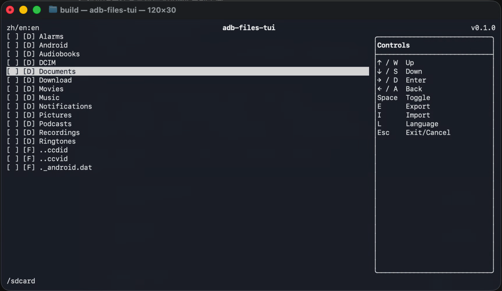

# adb-files-tui
a tui file manager by adb tools

adb-files-tui is built on top of adb to make it faster to manage and inspect files on Android devices from macOS. It provides basic file management workflows that help developers browse, import, and export device files during development.

Languages: English | [中文](README_ZH.md)

## Project History

This project was implemented entirely through vibe coding. The full vibe coding process, including prompts, plans, implementation notes, and verification records, is documented in [CODEX_HISTORY.md](CODEX_HISTORY.md).

## Preview



## Download

- [macOS arm64 executable](dist/adb-files-tui-darwin-arm64)

The release executable statically links FTXUI into the binary. It still expects `adb` to be available either from `PATH` or from the optional `adb-path` argument.

## Build

The default build downloads FTXUI v7.0.0 from source and links it statically into the executable:

```sh
cmake -S . -B build -DADB_FILES_TUI_STATIC_FTXUI=ON
cmake --build build
```

You can also use a system-installed FTXUI package:

```sh
brew install ftxui
cmake -S . -B build -DADB_FILES_TUI_STATIC_FTXUI=OFF
cmake --build build
```

## Run

```sh
./build/adb-files-tui
```

The executable accepts three optional arguments:

```sh
./build/adb-files-tui [output-directory] [adb-device-serial] [adb-path]
```

- `output-directory`: directory used for exported files. If omitted, the current working directory is used.
- `adb-device-serial`: target adb device serial. If omitted, the first `adb devices` entry with state `device` is used.
- `adb-path`: adb executable path, or a directory containing `adb`. If omitted, `adb` is resolved from the system `PATH`.

For example, on this machine:

```sh
./build/adb-files-tui . "" /Users/devq-mini/Library/Android/sdk/platform-tools
```

## Controls

- `Up` / `W`: move the cursor up.
- `Down` / `S`: move the cursor down.
- `Right` / `D`: enter a directory.
- `Left` / `A`: return to the parent directory. The remote root `/` cannot go higher.
- `Space`: select or unselect the current file or directory.
- `E`: export selected files or directories.
- `I`: import one local file into the current remote directory.
- `O`: switch sorting between name and modified time.
- `L`: switch language between Chinese and English.
- `Esc`: exit on the home screen, cancel or close dialogs.
