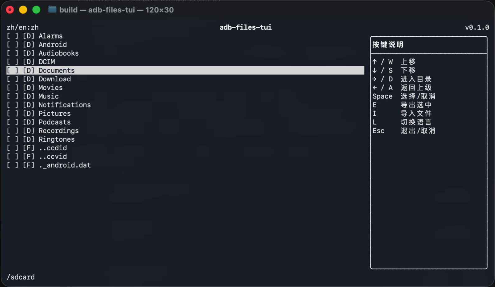

# adb-files-tui
一个基于 adb 工具的 TUI 文件管理器。

该工程基于 adb 工具开发，旨在解决 Mac 平台下无法快速管理和查阅 Android 设备中的文件的问题。基于该工具可以实现基础的文件管理，便于开发人员进行开发。

语言：[English](README.md) | 中文

## 项目历史

该工程完全通过 vibe coding 实现。完整的 vibe coding 过程，包括提示词、方案、实现记录和验证结果，均记录在 [CODEX_HISTORY.md](CODEX_HISTORY.md) 中。

## 预览



## 下载

- [macOS arm64 可执行文件](dist/adb-files-tui-darwin-arm64)

该发布可执行文件已将 FTXUI 静态链接进二进制文件中。程序仍需要通过系统 `PATH` 或可选的 `adb路径` 参数找到 `adb`。

## 构建

默认构建会从源码下载 FTXUI v7.0.0，并将其静态链接进可执行文件：

```sh
cmake -S . -B build -DADB_FILES_TUI_STATIC_FTXUI=ON
cmake --build build
```

也可以使用系统中已安装的 FTXUI 包：

```sh
brew install ftxui
cmake -S . -B build -DADB_FILES_TUI_STATIC_FTXUI=OFF
cmake --build build
```

## 运行

```sh
./build/adb-files-tui
```

可执行文件接受三个可选参数：

```sh
./build/adb-files-tui [输出目录] [adb设备序列号] [adb路径]
```

- `输出目录`：用于保存导出文件的目录。如果省略，则使用当前工作目录。
- `adb设备序列号`：目标 adb 设备序列号。如果省略，则使用 `adb devices` 中第一个状态为 `device` 的设备。
- `adb路径`：adb 可执行文件路径，或包含 `adb` 的目录。如果省略，则从系统 `PATH` 中解析 `adb`。

例如，在当前机器上：

```sh
./build/adb-files-tui . "" /Users/devq-mini/Library/Android/sdk/platform-tools
```

## 控制

- `Up` / `W`：向上移动光标。
- `Down` / `S`：向下移动光标。
- `Right` / `D`：进入目录。
- `Left` / `A`：返回父目录。远端根目录 `/` 无法继续向上返回。
- `Space`：选择或取消选择当前文件或目录。
- `E`：导出选中的文件或目录。
- `I`：向当前远端目录导入一个本地文件。
- `O`：在按名称排序和按修改时间排序之间切换。
- `L`：在中文和英文之间切换语言。
- `Esc`：在主页退出，或取消/关闭对话框。
